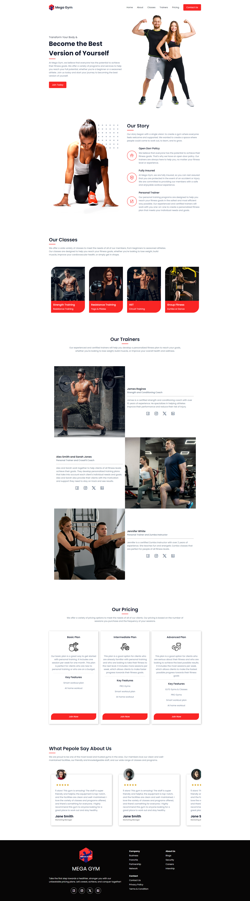

# Mega Gym Website

This is a Gym Website build whit HTNL, SCSS, JS Whit Vite ,mobile responsive.

- [Introduction](#introduction)
- [Installation](#installation)

## Logo of Mega Gym 
.png)

### Screenshot



## Introduction

Welcome to the Mega Gym website project! This web application is designed to showcase the offerings of Mega Gym through various components, making it easy for visitors to explore and understand what we have to offer. The website comprises several key sections, each tailored to provide specific information and enhance the user experience

## Installation

To run and develop the Mega Gym website, you'll need npm (Node Package Manager) installed on your machine. Follow these steps:

1. Clone the repository to your local machine using Git:

```bash
  git clone https://github.com/yourusername/mega-gym-website.git
```
2. Navigate to the project directory:

```bash
  cd mega-gym
```

3. Install project dependencies using npm:

```bash
  npm install
```

4. Start a local development server:

```bash
  npm start
```
or if you use vite:
```bash
  npm run dev
```

